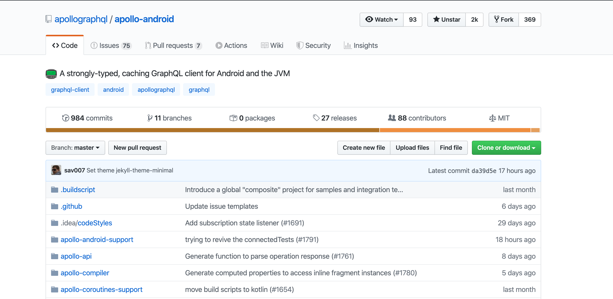
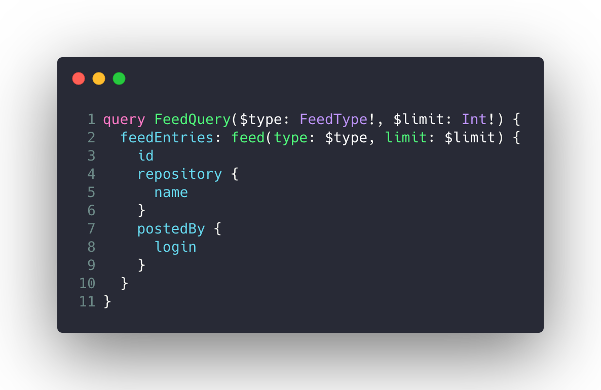
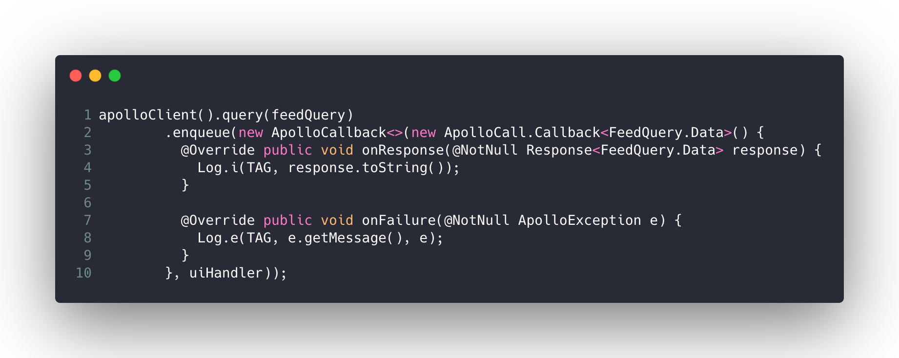
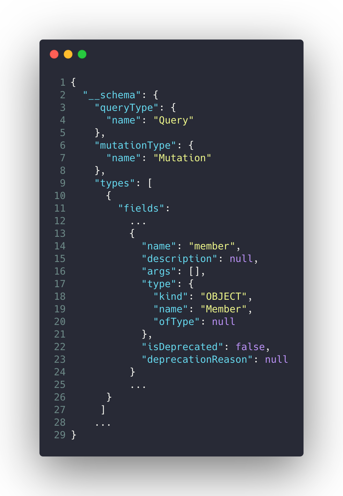
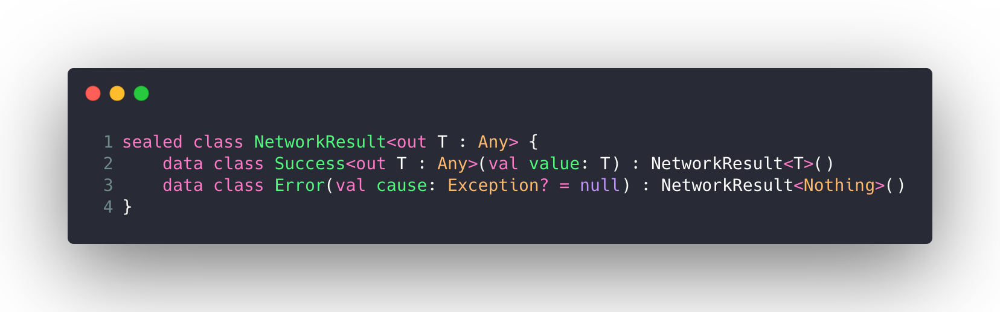
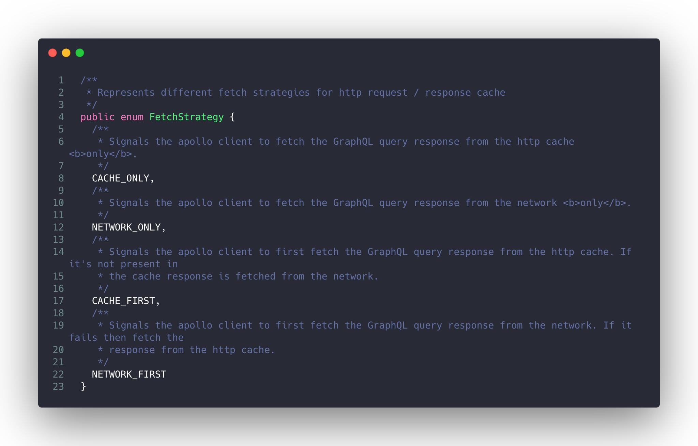
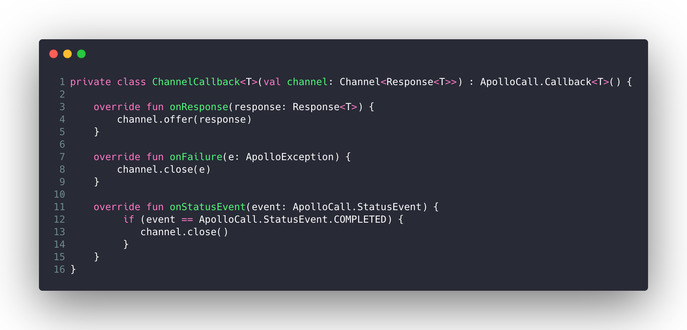

---?image=assets/image/cover.jpg&size=cover
---?image=assets/image/episodes.jpg&size=cover

---
@snap[]

@snapend

---

@snap[north]

@snapend

@snap[south span-90]

@snapend

---
[//]: # (Apollo code snippets)

@snap[north-east span-50 text-04 text-center]
Query.graphql

@snapend
@snap[south-east span-60 text-04 text-center]
Usage

@snapend

@snap[west span-45 text-04 text-center]
Schema.json

@snapend

---?image=assets/image/episode1.jpg&size=cover
---?image=assets/image/problem.jpg&size=cover
---

@snap[text-08]
@code[java](src/apollo-callbacks.java)
@snapend

@snap[south span-100 text-07 text-gray]
@[6-7](Traditional callbacks :()
@snapend

---?image=assets/image/solution-coroutines.jpg&size=cover
---?image=assets/image/architecture.jpg&size=cover
---

@snap[text-08 span-100]
@code[kotlin code-max](src/repository-1.kt)
@snapend

@snap[south span-100 text-07 text-gray]
@[02](ApolloClient wrapper)
@snapend

@snap[south-east span-20]

@snapend
---

@snap[text-07 span-100]
@code[kotlin code-max](src/apollo-service-1.kt)
@snapend

@snap[south-east span-20]

@snapend

---

@snap[text-08 span-100]
@code[kotlin code-max](src/repository-1.kt)
@snapend

@snap[south span-100 text-07 text-gray]
@[09](Awaits for completion)
@snapend

@snap[south-east span-20]

@snapend

---

@snap[text-08 span-100]
@code[kotlin code-max](src/to-deferred.kt)
@snapend

@snap[south span-100 text-07 text-gray]
@[03](Creates a Deferred object)
@[10-18](Still a callback under the hood)
@snapend

---

@snap[text-08 span-100]
@code[kotlin code-max](src/repository-1.kt)
@snapend

@snap[south-east span-20]

@snapend
---

@snap[text-08 span-100]
@code[kotlin code-max](src/repository-1.kt)
@snapend

@snap[south-east span-70] 

@snapend

--- 

@snap[west text-08 span-100]
@code[kotlin code-max](src/repository-2.kt)
@snapend

@snap[south-east span-70] 

@snapend

---
@snap[west text-07 span-150]
@code[kotlin code-max code-wrap](src/apollo-service-2-impl.kt)
@snapend

@snap[south span-100 text-07 text-gray]
@[04-05](Represents the fetch strategy)
@snapend

@snap[south-east span-20]

@snapend

@snap[south-west span-70 fragment] 

@snapend

---

@snap[text-07 span-100]
@code[kotlin code-max code-wrap](src/apollo-service-2-impl.kt)
@snapend

@[07-22]

@snap[south-east span-20]

@snapend
---

@snap[text-08 span-100]
@code[kotlin code-max](src/repository-3-final.kt)
@snapend

@snap[south-east span-20]

@snapend

---

@snap[text-08 span-100]
@code[kotlin code-max](src/viewmodel-1.kt)
@snapend

@snap[south span-100 text-07 text-gray]
@[03-04](Expose some LiveData)
@[08](Tied to the lifecycle of the ViewModel)
@[14-19](How sealed classes are useful)
@snapend

@snap[south-east span-20]

@snapend

---?image=assets/image/recap.jpg&size=cover
---?image=assets/image/episode2.jpg&size=cover
---?image=assets/image/problem.jpg&size=cover
---?image=assets/image/solution-channels.jpg&size=cover

---

@snap[text-08 span-100]
@code[kotlin code-max code-wrap](src/apollo-service-3.kt)
@snapend

@snap[south span-100 text-07 text-gray]
@[06](Allows to get a "flow" of data)
@[07](An ApolloCall extension function)
@snapend

@snap[south-east span-20]

@snapend

---

@snap[north-east text-08 span-100]
@code[kotlin code-max](src/to-network-flow.kt)
@snapend

@snap[south span-100 text-07 text-gray]
@[01](Cold streams)
@[02](Creates a channel where the response will be passed through)
@[04](Extends ApolloCall.Callback and sets up the channel)
@snapend

@snap[east span-90 fragment] 

@snapend

@snap[south-east span-20]

@snapend

---

@snap[text-08 span-100]
@code[kotlin code-max](src/to-network-flow.kt)
@snapend

@snap[south span-100 text-07 text-gray]
@[06-16](Emit should happen strictly in the dispatchers of the block in order to preserve the flow context)
@snapend

@snap[south-east span-20]

@snapend

---

@snap[text-08 span-100]
@code[kotlin code-max](src/viewmodel-2.kt)
@snapend

@snap[south span-100 text-07 text-gray]
@[05](Starts executing when live data becomes active)
@[07-11](Collect the values of the flow)
@snapend

@snap[south-east span-20]

@snapend

---?image=assets/image/recap.jpg&size=cover
---?image=assets/image/final.jpg&size=cover

@snap[east span-50]

@snapend
